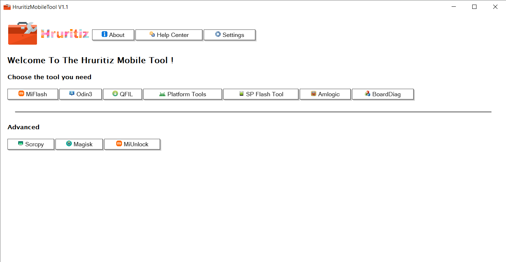
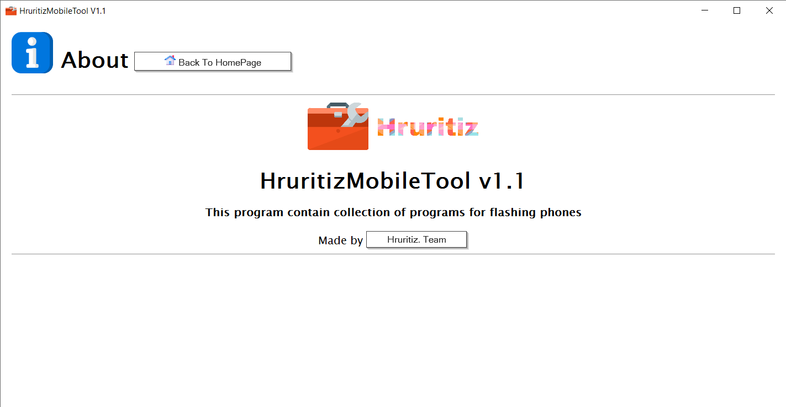
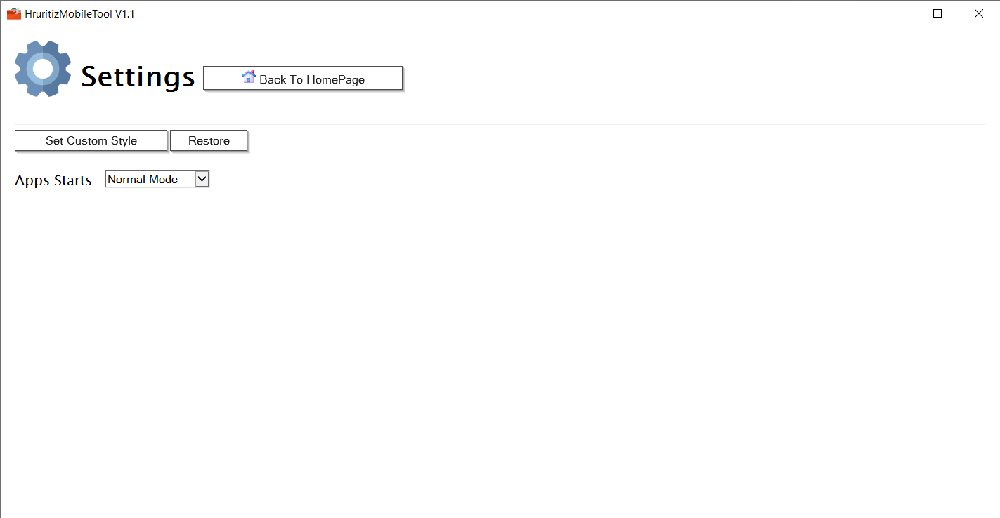

#  HruritizMobileTool

Launcher and collection of programs that makes it easier to download unnecessary tools by consolidating everything into one! The program also installs drivers and necessary libraries for apps to run.

## Specifications
- Free to use
- Open Source
- No Analytics
- Clean and simple
- Offline Access

---

## Screenshots

### Home

### About Application

### Settings

---

## Installation

1. Download the latest `.exe` file from the [**Releases**](https://github.com/hruritiz/HruritizMobileTool/releases) section.
2. Run the installer and follow the on-screen instructions.

**Minimum supported OS:** Windows 7 